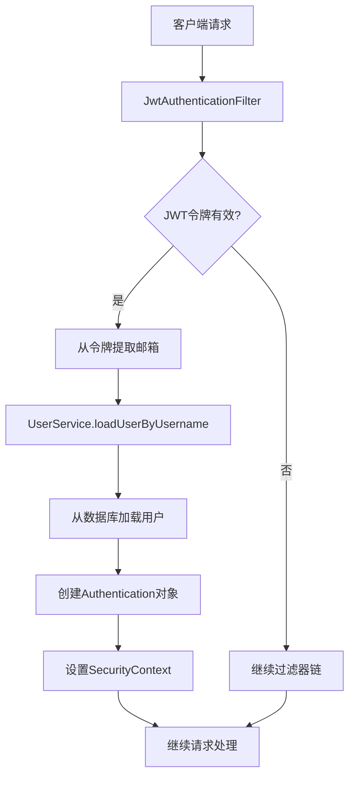
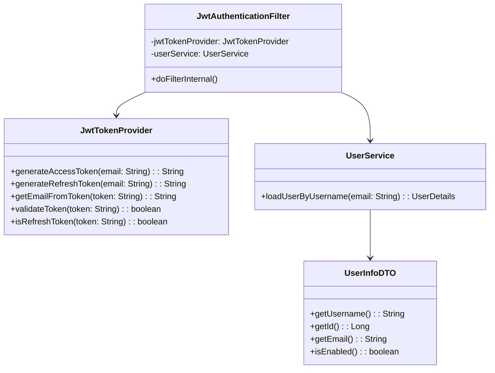
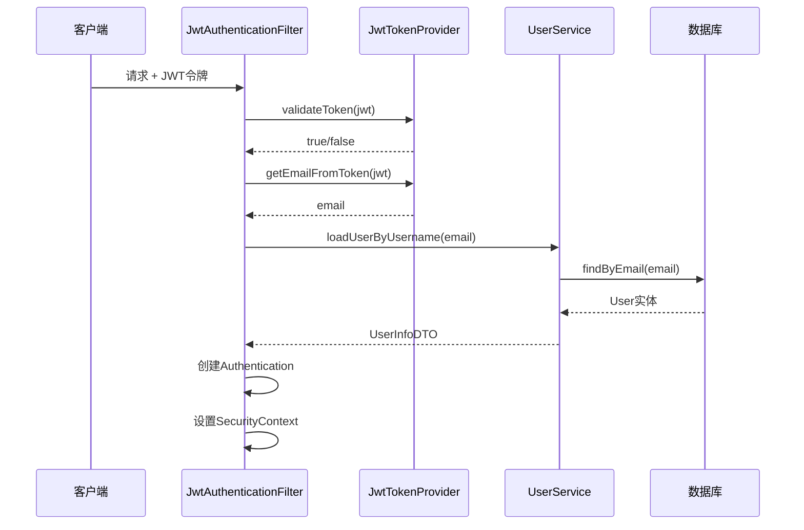

# JWT认证优化设计文档

## 概述

本设计文档基于需求文档，为HeartPlan约会应用的JWT认证系统提供优化方案。主要目标是简化认证流程，提高性能，并遵循Spring Security的最佳实践。

## 架构设计

### 整体架构



### 核心组件关系



## 组件和接口设计

### 1. JwtTokenProvider 优化

#### 设计原则
- 保持现有令牌结构不变
- 优化令牌生成和验证的代码逻辑
- 简化认证过滤器中的处理流程
- 移除不必要的复杂逻辑

#### 优化重点
- 简化JwtAuthenticationFilter中的双重认证逻辑
- 统一使用邮箱作为用户标识符
- 移除getUserDetailsFromToken方法的复杂实现
- 优化异常处理和日志记录

### 2. JwtAuthenticationFilter 简化

#### 设计原则
- 移除复杂的多重认证逻辑
- 直接通过邮箱加载用户信息
- 统一异常处理

#### 核心逻辑设计

```java
@Component
public class JwtAuthenticationFilter extends OncePerRequestFilter {
    
    @Override
    protected void doFilterInternal(HttpServletRequest request, 
                                  HttpServletResponse response, 
                                  FilterChain filterChain) throws ServletException, IOException {
        try {
            String jwt = getJwtFromRequest(request);
            
            if (StringUtils.hasText(jwt) && jwtTokenProvider.validateToken(jwt)) {
                String email = jwtTokenProvider.getUsernameFromToken(jwt);
                UserDetails userDetails = userService.loadUserByUsername(email);
                
                if (userDetails != null && userDetails.isEnabled()) {
                    UsernamePasswordAuthenticationToken authentication = 
                        new UsernamePasswordAuthenticationToken(
                            userDetails, null, userDetails.getAuthorities());
                    
                    authentication.setDetails(new WebAuthenticationDetailsSource().buildDetails(request));
                    SecurityContextHolder.getContext().setAuthentication(authentication);
                }
            }
        } catch (Exception ex) {
            log.error("JWT认证失败: {}", ex.getMessage());
            SecurityContextHolder.clearContext();
        }
        
        filterChain.doFilter(request, response);
    }
}
```

### 3. UserService 标准化

#### 设计原则
- 按照Spring Security标准实现
- 使用邮箱作为loadUserByUsername的参数
- 统一异常处理

#### 实现设计

```java
@Service
public class UserService implements UserDetailsService {
    
    @Override
    public UserDetails loadUserByUsername(String email) throws UsernameNotFoundException {
        User user = userRepository.findByEmail(email)
            .orElseThrow(() -> new UsernameNotFoundException("用户不存在: " + email));
        
        if (!user.getEnabled()) {
            throw new DisabledException("用户账户已禁用: " + email);
        }
        
        return userMapper.toUserInfo(user);
    }
}
```

### 4. UserInfoDTO 规范化

#### 设计原则
- getUsername()返回邮箱（认证标识符）
- 提供getId()方法获取用户ID
- 提供getDisplayName()方法获取显示名称

#### 接口设计

```java
@Data
@Builder
public class UserInfoDTO implements UserDetails {
    
    private Long id;
    private String email;
    private String username; // 显示名称
    private Boolean enabled;
    // 其他用户信息字段...
    
    @Override
    public String getUsername() {
        return email; // 返回邮箱作为认证标识符
    }
    
    public Long getId() {
        return id;
    }
    
    public String getDisplayName() {
        return username; // 返回显示名称
    }
    
    @Override
    public Collection<? extends GrantedAuthority> getAuthorities() {
        return Collections.emptyList(); // 约会应用不需要权限
    }
    
    @Override
    public boolean isEnabled() {
        return Boolean.TRUE.equals(enabled);
    }
    
    // 其他UserDetails方法返回true（不需要复杂的账户状态管理）
}
```

## 数据模型

### JWT令牌结构

保持现有的JWT令牌内部结构完全不变，只优化代码逻辑和性能。

### 用户认证流程数据



## 错误处理

### 异常类型和处理策略

1. **JWT令牌异常**
   - `ExpiredJwtException`: 令牌过期
   - `MalformedJwtException`: 令牌格式错误
   - `SecurityException`: 签名验证失败

2. **用户认证异常**
   - `UsernameNotFoundException`: 用户不存在
   - `DisabledException`: 用户账户被禁用

3. **错误响应格式**

保持现有的ApiResponse格式不变。

### JwtAuthenticationEntryPoint 优化

```java
@Component
public class JwtAuthenticationEntryPoint implements AuthenticationEntryPoint {
    
    @Override
    public void commence(HttpServletRequest request, 
                        HttpServletResponse response,
                        AuthenticationException authException) throws IOException {
        
        response.setStatus(HttpServletResponse.SC_UNAUTHORIZED);
        response.setContentType(MediaType.APPLICATION_JSON_VALUE);
        response.setCharacterEncoding("UTF-8");
        
        ApiResponse<Object> errorResponse = ApiResponse.error(401, "Authentication failed");
        
        ObjectMapper mapper = new ObjectMapper();
        mapper.writeValue(response.getOutputStream(), errorResponse);
    }
}
```

## 性能优化策略

### 1. 减少数据库查询
- JWT令牌只存储邮箱，避免存储大量用户信息
- 用户信息按需从数据库加载
- 考虑添加Redis缓存用户信息（可选）

### 2. 令牌验证优化
- 使用高效的HMAC-SHA256算法
- 令牌验证失败时快速返回
- 避免不必要的异常处理

### 3. 内存使用优化
- UserInfoDTO只包含必要字段
- 移除不必要的用户信息缓存
- 及时清理SecurityContext

## 安全考虑

### 1. 令牌安全
- 使用强密钥进行签名
- 设置合理的令牌过期时间
- 刷新令牌与访问令牌分离

### 2. 用户信息安全
- 不在JWT中存储敏感信息
- 用户状态实时验证
- 禁用用户立即失效认证

### 3. 日志和监控
- 记录认证失败事件
- 监控异常令牌使用
- 安全事件告警

## 配置简化

### application.yml 优化
```yaml
jwt:
  secret: ${JWT_SECRET:heartplan-jwt-secret-key-2024-very-long-and-secure}
  expiration: 86400000 # 24小时
  refresh-expiration: 604800000 # 7天

logging:
  level:
    com.heartplan.security: INFO # 减少调试日志
```

## API响应格式

### 登录成功响应格式
保持现有格式不变：
```json
{
  "token": "eyJhbGciOiJIUzI1NiIsInR5cCI6IkpXVCJ9...",
  "refreshToken": "eyJhbGciOiJIUzI1NiIsInR5cCI6IkpXVCJ9...",
  "expiresIn": 86400000,
  "tokenType": "Bearer",
  "user": {
    "id": 123,
    "email": "user@example.com",
    "username": "JohnDoe",
    "age": 25,
    "gender": "MALE",
    "relationshipStatus": "SINGLE",
    "avatarUrl": "https://example.com/avatar.jpg",
    "location": "New York",
    "enabled": true,
    "createdAt": "2024-01-01T10:00:00"
  }
}
```