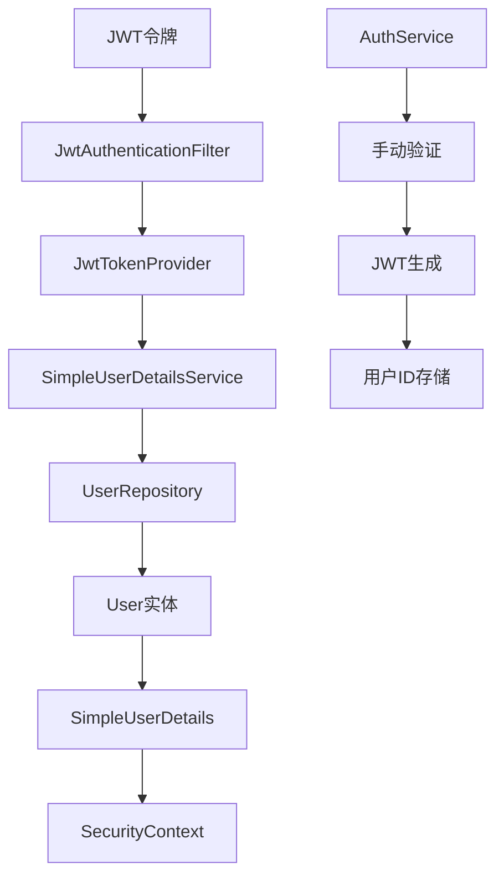

# 设计文档

## 概述

本设计文档描述了为HeartPlan恋爱规划应用实现极简化UserDetails的技术方案。设计目标是使用最少的代码实现Spring Security集成，只验证用户是否已登录，不进行任何权限管理。整个实现将保持现有代码的简单性，最小化改动。

## 架构

### 整体架构图



### 核心组件关系

- **SimpleUserDetails**: 极简化的UserDetails实现，只包含必要字段
- **SimpleUserDetailsService**: 通过用户ID加载用户详情的服务
- **JwtAuthenticationFilter**: 修改后的JWT过滤器，集成UserDetailsService
- **JwtTokenProvider**: 修改后的JWT工具，支持用户ID存储
- **AuthService**: 保持现有简单性，最小化改动

## 组件和接口

### 1. 修改UserInfoDTO实现UserDetails

```java
// 在现有UserInfoDTO类中添加UserDetails接口实现
@Data
@Builder
@NoArgsConstructor
@AllArgsConstructor
public class UserInfoDTO implements UserDetails {
    
    // 保持现有字段不变
    private Long id;
    private String email;
    private String username;
    private Integer age;
    private User.Gender gender;
    private User.RelationshipStatus relationshipStatus;
    private String avatarUrl;
    private String location;
    private Boolean enabled;
    private LocalDateTime createdAt;
    
    // 实现UserDetails接口方法
    @Override
    public Collection<? extends GrantedAuthority> getAuthorities() {
        return Collections.emptyList();
    }
    
    @Override
    public String getPassword() {
        return null;
    }
    
    @Override
    public String getUsername() {
        return id != null ? id.toString() : null;
    }
    
    @Override
    public boolean isAccountNonExpired() {
        return true;
    }
    
    @Override
    public boolean isAccountNonLocked() {
        return true;
    }
    
    @Override
    public boolean isCredentialsNonExpired() {
        return true;
    }
    
    @Override
    public boolean isEnabled() {
        return Boolean.TRUE.equals(enabled);
    }
}
```

### 2. 创建SimpleUserDetailsService

```java
@Service
@RequiredArgsConstructor
@Slf4j
public class SimpleUserDetailsService implements UserDetailsService {
    
    private final UserRepository userRepository;
    private final UserMapper userMapper;
    
    @Override
    public UserDetails loadUserByUsername(String username) throws UsernameNotFoundException {
        try {
            Long userId = Long.parseLong(username);
            User user = userRepository.findById(userId)
                .orElseThrow(() -> new UsernameNotFoundException("用户不存在: " + userId));
            
            if (!user.getEnabled()) {
                throw new DisabledException("用户账户已禁用: " + userId);
            }
            
            return userMapper.toUserInfo(user);
        } catch (NumberFormatException e) {
            throw new UsernameNotFoundException("无效的用户ID格式: " + username);
        }
    }
}
```

### 3. 修改JwtTokenProvider

```java
// 在现有JwtTokenProvider中添加新方法
public String generateAccessToken(User user) {
    Date expiryDate = new Date(System.currentTimeMillis() + jwtExpirationMs);
    
    return Jwts.builder()
            .setSubject(user.getId().toString())
            .claim("email", user.getEmail())
            .claim("username", user.getUsername())
            .claim("age", user.getAge())
            .claim("gender", user.getGender().toString())
            .claim("relationshipStatus", user.getRelationshipStatus().toString())
            .claim("avatarUrl", user.getAvatarUrl())
            .claim("location", user.getLocation())
            .claim("enabled", user.getEnabled())
            .setIssuedAt(new Date())
            .setExpiration(expiryDate)
            .signWith(getSigningKey(), SignatureAlgorithm.HS256)
            .compact();
}

public UserInfoDTO getUserDetailsFromToken(String token) {
    Claims claims = Jwts.parserBuilder()
            .setSigningKey(getSigningKey())
            .build()
            .parseClaimsJws(token)
            .getBody();
    
    return UserInfoDTO.builder()
            .id(Long.parseLong(claims.getSubject()))
            .email(claims.get("email", String.class))
            .username(claims.get("username", String.class))
            .age(claims.get("age", Integer.class))
            .gender(User.Gender.valueOf(claims.get("gender", String.class)))
            .relationshipStatus(User.RelationshipStatus.valueOf(claims.get("relationshipStatus", String.class)))
            .avatarUrl(claims.get("avatarUrl", String.class))
            .location(claims.get("location", String.class))
            .enabled(claims.get("enabled", Boolean.class))
            .build();
}
```

### 4. 修改JwtAuthenticationFilter

```java
// 在现有JwtAuthenticationFilter中添加UserDetailsService依赖
@Component
@Slf4j
@RequiredArgsConstructor
public class JwtAuthenticationFilter extends OncePerRequestFilter {

    private final JwtTokenProvider jwtTokenProvider;
    private final SimpleUserDetailsService userDetailsService;

    @Override
    protected void doFilterInternal(HttpServletRequest request, 
                                  HttpServletResponse response, 
                                  FilterChain filterChain) throws ServletException, IOException {
        try {
            String jwt = getJwtFromRequest(request);
            
            if (StringUtils.hasText(jwt) && jwtTokenProvider.validateToken(jwt)) {
                UserDetails userDetails = null;
                try {
                    userDetails = jwtTokenProvider.getUserDetailsFromToken(jwt);
                } catch (Exception e) {
                    String userId = jwtTokenProvider.getUsernameFromToken(jwt);
                    userDetails = userDetailsService.loadUserByUsername(userId);
                }
                
                if (userDetails != null && userDetails.isEnabled()) {
                    UsernamePasswordAuthenticationToken authentication = 
                        new UsernamePasswordAuthenticationToken(
                            userDetails, null, userDetails.getAuthorities());
                    
                    authentication.setDetails(new WebAuthenticationDetailsSource().buildDetails(request));
                    SecurityContextHolder.getContext().setAuthentication(authentication);
                }
            }
            
        } catch (Exception ex) {
            log.error("JWT认证失败: {}", ex.getMessage());
            SecurityContextHolder.clearContext();
        }
        
        filterChain.doFilter(request, response);
    }
}
```

### 5. 修改AuthService

```java
// 在现有AuthService中修改JWT令牌生成部分
public AuthResponse login(LoginRequest loginRequest) {
    // ... 保持现有的验证逻辑完全不变 ...
    
    // 使用新的generateAccessToken方法
    String accessToken = jwtTokenProvider.generateAccessToken(user);
    String refreshToken = jwtTokenProvider.generateRefreshToken(user.getEmail());
    
    // 使用现有的mapper方法
    return userMapper.toAuthResponse(accessToken, refreshToken, userMapper.toUserInfo(user));
}

public AuthResponse register(RegisterRequest registerRequest) {
    // ... 保持现有的注册逻辑完全不变 ...
    
    // 使用新的generateAccessToken方法
    String accessToken = jwtTokenProvider.generateAccessToken(savedUser);
    String refreshToken = jwtTokenProvider.generateRefreshToken(savedUser.getEmail());
    
    return userMapper.toAuthResponse(accessToken, refreshToken, userMapper.toUserInfo(savedUser));
}
```

## 数据模型

### UserDetails数据结构

```java
// 复用现有的UserInfoDTO，添加UserDetails接口实现
public class UserInfoDTO implements UserDetails {
    private Long id;                                  // 用户ID，作为主键
    private String email;                             // 用户邮箱
    private String username;                          // 用户显示名称
    private Integer age;                              // 用户年龄
    private User.Gender gender;                       // 用户性别
    private User.RelationshipStatus relationshipStatus; // 恋爱状态
    private String avatarUrl;                         // 头像URL
    private String location;                          // 所在位置
    private Boolean enabled;                          // 账户启用状态
    private LocalDateTime createdAt;                  // 创建时间
}
```

**字段说明**:
- 复用现有UserInfoDTO的所有字段，不新增任何字段
- `id`: 用户的唯一标识，用作Spring Security的username
- `enabled`: 账户启用状态，唯一需要检查的状态
- 其他字段保持现有用途不变

### 企业级API响应结构

```json
{
  "token": "eyJhbGciOiJIUzI1NiIsInR5cCI6IkpXVCJ9...",
  "refreshToken": "eyJhbGciOiJIUzI1NiIsInR5cCI6IkpXVCJ9...",
  "expiresIn": 86400000,
  "tokenType": "Bearer",
  "user": {
    "id": 123,
    "email": "user@example.com",
    "username": "JohnDoe",
    "age": 25,
    "gender": "MALE",
    "relationshipStatus": "SINGLE",
    "avatarUrl": "https://example.com/avatar.jpg",
    "location": "New York",
    "enabled": true,
    "createdAt": "2024-01-01T10:00:00"
  }
}
```


